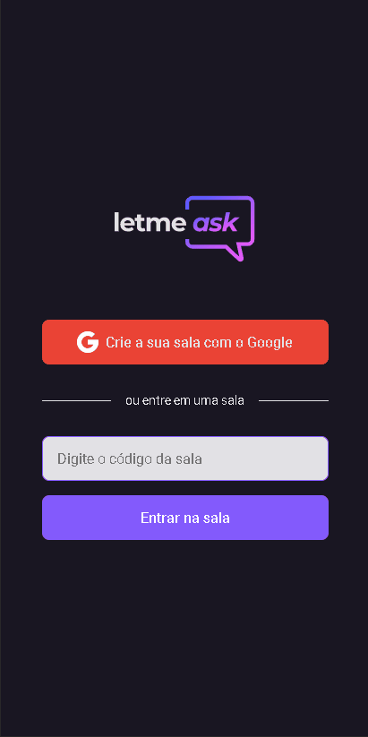

<h1 align="center">
  
</h1>

## **<h2 align="center">Front end application  💻</h2>**

## 
<h2 align="center">An app that brings together people who want to ask questions with those who want to answer them in the best way developed in #NLW06 delivered by [Rocketseat](https://app.rocketseat.com.br/dashboard)</h2> 

### 
  

  <a href="#computer-demonstration-of-the-application-web">Demonstration of the application</a>&nbsp;&nbsp;&nbsp;|&nbsp;&nbsp;&nbsp;
  <a href="#rocket-technologies-used">Technologies used</a>&nbsp;&nbsp;&nbsp;|&nbsp;&nbsp;&nbsp;
  <a href="#information_source-application-installation">Application installation</a>

# :computer: Demonstration of the application Web

  

 

# **Demonstration of the application - Mobile Layout** 📱

  

 

<h3 align="center"> 
	 Application status: Finalized ✔️
</h3>

 

<h3 align="center">
   In addition to developing the initial application offered in the classes, I added more features to the application, such as:
</h3>

###
* Responsive layout
* Dark theme by default
* Performance with useMemo() and useCallback()
* Changes in project structure
* Small additions in stylizations

<h2 align="center"> 
	Web application: https://letmeask-mathwcruz.web.app/
</h2>
 

## :star: Features
- [x] Log in to the app through a Google account
- [x] Create a room
- [x] Share room code to other users
- [x] Enter a room with your code
- [x] Ask a question
- [x] Like a question
- [x] Highlight a question
- [x] Mark a question as answered
- [x] Delete a question
- [x] Close the room

 

## :rocket: Technologies used:

 

## :information_source: Application installation
- `git clone https://github.com/mathwcruz/letmeask_nlw06.git` to clone the repository

 

# 🎲 Run application
To run the application on the web, follow the instructions from your terminal:
- `cd letmeask_nlw06` and `code .`
- run `yarn` to install the dependencies of the project
- Run `yarn dev` to run the application, will open at the address `localhost:3000`

 

### Autor
---

<a href="https://app.rocketseat.com.br/me/matheus-da-cruz-frontend">
 
  
 <b>Matheus da Cruz</b></a> <a href="https://app.rocketseat.com.br/me/matheus-da-cruz-frontend" title="Rocketseat">  🚀</a>

Desenvolvido por Matheus da Cruz 😊

 

 
